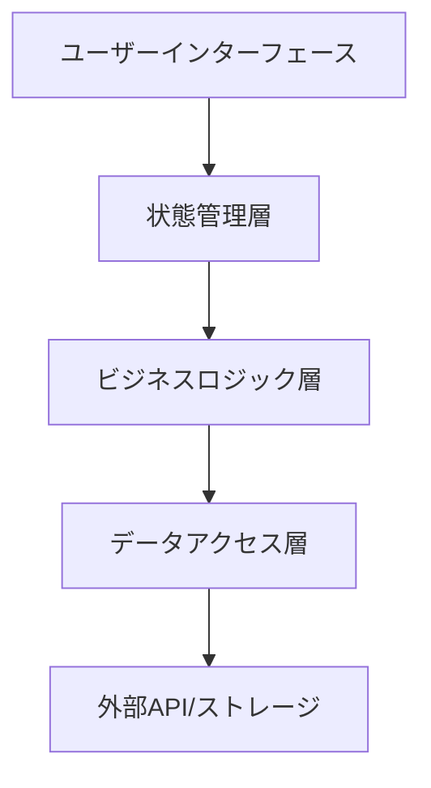
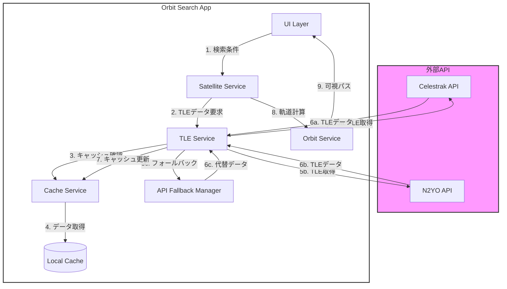

# アーキテクチャ設計書

## 1. システム概要

### 1.1 アーキテクチャの特徴
- シングルページアプリケーション（SPA）
- クライアントサイドレンダリング
- サーバーレスアーキテクチャ
- ローカルファーストな設計
- マルチAPIソース対応

### 1.2 主要コンポーネント


## 2. レイヤー構成

### 2.1 プレゼンテーション層
- React コンポーネント
- Material-UI ウィジェット
- Leaflet 地図コンポーネント
- レスポンシブデザイン対応

### 2.2 状態管理層
```typescript
// Zustandによる状態管理
interface AppState {
  selectedLocation: Location;
  dateRange: DateRange;
  satellites: Satellite[];
  visibilityFilters: VisibilityFilters;
  apiSource: 'celestrak' | 'n2yo' | 'auto'; // 新しいAPIソース選択機能
}
```

### 2.3 ビジネスロジック層
- 衛星軌道計算
- 可視性判定
- データ変換処理
- マルチAPIデータ整合性検証

### 2.4 データアクセス層
- TLEデータ取得
- ローカルストレージ管理
- キャッシュ制御
- APIフォールバックメカニズム

## 3. TLEデータ検索と処理フロー

### 3.1 システム連携図


### 3.2 APIフォールバック戦略
```typescript
class APIFallbackManager {
  private apis: APISource[] = [
    { name: 'celestrak', priority: 1 },
    { name: 'n2yo', priority: 2 }
  ];

  async fetchTLEData(satelliteId: string): Promise<TLEData> {
    for (const api of this.apis) {
      try {
        const data = await this.fetchFromAPI(api.name, satelliteId);
        if (this.validateTLEData(data)) {
          return data;
        }
      } catch (error) {
        // APIごとの特定のエラーハンドリング
        this.logAPIError(api.name, error);
      }
    }
    throw new Error('すべてのAPIソースからのデータ取得に失敗');
  }

  private validateTLEData(data: TLEData): boolean {
    // データの整合性を検証
    return data && data.line1 && data.line2;
  }
}
```

### 3.3 エラーハンドリング戦略の詳細
```typescript
enum ErrorType {
  API_CONNECTION,
  RATE_LIMIT,
  DATA_VALIDATION,
  CALCULATION_ERROR
}

class ErrorHandler {
  static handle(error: Error, type: ErrorType): ErrorNotification {
    switch (type) {
      case ErrorType.API_CONNECTION:
        return {
          type: 'API_CONNECTION',
          message: 'APIへの接続に失敗しました。代替APIを使用します。',
          severity: 'warning'
        };
      case ErrorType.RATE_LIMIT:
        return {
          type: 'RATE_LIMIT',
          message: 'APIリクエスト制限に達しました。しばらく待ってから再試行します。',
          severity: 'info'
        };
      // 他のエラータイプも同様に定義
    }
  }
}
```

## 4. セキュリティ強化

### 4.1 データ保護の具体的な実装
```typescript
class SecurityManager {
  // APIキーの暗号化
  private encryptAPIKey(key: string): string {
    // 実際の暗号化ロジック
    return btoa(key); // Base64エンコーディングの例
  }

  // 入力バリデーション
  validateCoordinates(lat: number, lng: number): boolean {
    return (
      lat >= -90 && lat <= 90 &&
      lng >= -180 && lng <= 180
    );
  }

  // TLEデータ形式チェック
  validateTLEFormat(line1: string, line2: string): boolean {
    const tleRegex = /^1 \d{5}[A-Z] \d{5}[A-Z]{3} \d{14}\.\d{8} [\-+]\.\d{8} \d{5}[\-+]?\d \d{4}[\-+]?\d \d{7} \d{4}$/;
    return tleRegex.test(line1) && tleRegex.test(line2);
  }
}
```

## 5. モニタリングと最適化

### 5.1 パフォーマンス監視の高度な実装
```typescript
class PerformanceMonitor {
  private metrics: PerformanceMetrics = {
    calculationTime: [],
    memoryUsage: [],
    renderTime: []
  };

  trackCalculationPerformance(callback: () => void) {
    const start = performance.now();
    callback();
    const end = performance.now();
    this.metrics.calculationTime.push(end - start);
  }

  generatePerformanceReport() {
    return {
      averageCalculationTime: this.calculateAverage(this.metrics.calculationTime),
      peakMemoryUsage: Math.max(...this.metrics.memoryUsage),
      // 他のメトリクス
    };
  }
}
```

## 6. 更新履歴

### 2025/2/21
- 初期アーキテクチャ設計の文書化
- 基本的なコンポーネント構造の定義
- 状態管理戦略の概要

### 2025/3/4
- APIフォールバック戦略の詳細化
- エラーハンドリングの具体的な実装例の追加
- セキュリティ対策の具体的な実装方法を記述
- モニタリング戦略の高度な実装例を追加
- マルチAPIソース対応の設計を強化
