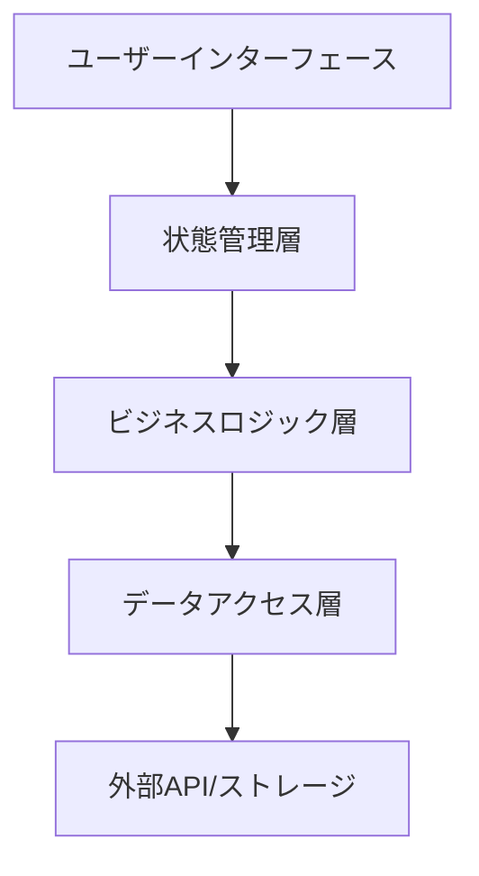
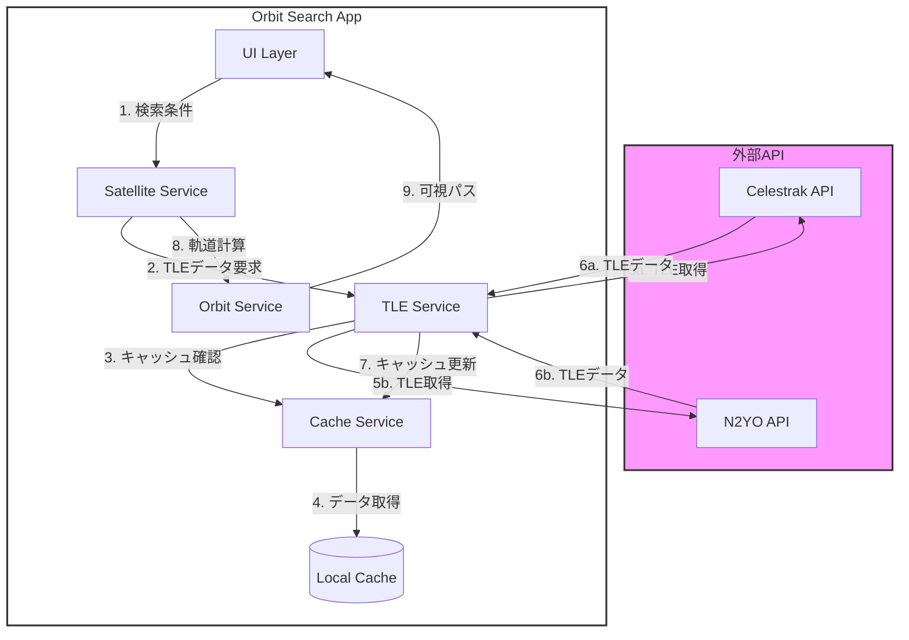
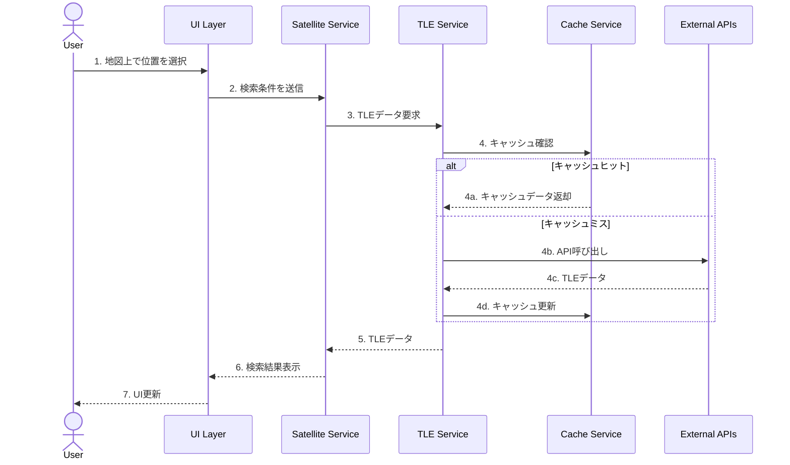
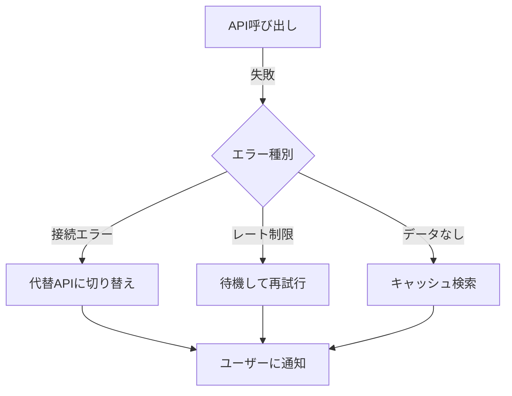

# アーキテクチャ設計書

## 1. システム概要

### 1.1 アーキテクチャの特徴
- シングルページアプリケーション（SPA）
- クライアントサイドレンダリング
- サーバーレスアーキテクチャ
- ローカルファーストな設計

### 1.2 主要コンポーネント


## 2. レイヤー構成

### 2.1 プレゼンテーション層
- React コンポーネント
- Material-UI ウィジェット
- Leaflet 地図コンポーネント

### 2.2 状態管理層
```typescript
// Zustandによる状態管理
interface AppState {
  selectedLocation: Location;
  dateRange: DateRange;
  satellites: Satellite[];
  visibilityFilters: VisibilityFilters;
}
```

### 2.3 ビジネスロジック層
- 衛星軌道計算
- 可視性判定
- データ変換処理

### 2.4 データアクセス層
- TLEデータ取得
- ローカルストレージ管理
- キャッシュ制御

## 3. TLEデータ検索と処理フロー

### 3.1 システム連携図


### 3.2 TLEデータ検索フロー


### 3.3 データフローの詳細説明

#### 検索開始フェーズ
1. ユーザーが地図上で位置を選択
2. UIレイヤーが選択された位置情報を元に検索条件を作成
3. Satellite Serviceが検索条件を受け取り、処理を開始

#### TLEデータ取得フェーズ
4. TLE Serviceがキャッシュを確認
5. キャッシュミスの場合、外部APIに接続
   - 主にCelestrakを使用
   - 必要に応じてN2YO APIをフォールバックとして使用
6. 取得したデータをキャッシュに保存

#### 軌道計算フェーズ
7. 取得したTLEデータを使用して軌道計算を実行
8. 計算結果から可視パスを生成
9. UIに結果を返却して表示

### 3.4 キャッシュ戦略
```typescript
interface CacheStrategy {
  // キャッシュの有効期間（分）
  ttl: number;

  // キャッシュするデータの種類
  cacheTypes: {
    tle: boolean;      // TLEデータ
    orbits: boolean;   // 軌道計算結果
    searches: boolean; // 検索結果
  };

  // キャッシュサイズの制限（MB）
  maxSize: number;
}
```

### 3.5 エラーハンドリング戦略


## 4. コンポーネント設計

### 4.1 Mapコンポーネント
```typescript
interface MapProps {
  center: LatLng;
  zoom: number;
  onLocationSelect: (location: LatLng) => void;
  satellites?: Satellite[];
  orbitPaths?: OrbitPath[];
}
```

### 4.2 SatelliteSearchコンポーネント
```typescript
interface SearchFilters {
  minElevation: number;
  dateRange: DateRange;
  location: LatLng;
}
```

### 4.3 OrbitDisplayコンポーネント
```typescript
interface OrbitProps {
  satellite: Satellite;
  timeRange: DateRange;
  groundTrack: GroundTrack[];
}
```

## 5. 状態管理

### 5.1 グローバル状態
```typescript
interface GlobalState {
  selectedSatellites: string[];
  location: Location;
  dateRange: DateRange;
  filters: FilterOptions;
}
```

### 5.2 ローカル状態
- コンポーネント固有の一時的な状態
- フォーム入力値
- UI表示状態

## 6. エラーハンドリング

### 6.1 エラー種別
- APIエラー
- 計算エラー
- バリデーションエラー

### 6.2 エラー通知
```typescript
interface ErrorNotification {
  type: ErrorType;
  message: string;
  severity: 'error' | 'warning' | 'info';
}
```

## 7. パフォーマンス最適化

### 7.1 メモ化戦略
- React.memo
- useMemo
- useCallback

### 7.2 遅延読み込み
```typescript
const OrbitDisplay = React.lazy(() =>
  import('./components/OrbitDisplay')
);
```

## 8. セキュリティ対策

### 8.1 データ保護
- APIキーの管理
- ユーザーデータの暗号化
- XSS対策

### 8.2 入力バリデーション
- 座標範囲チェック
- 日時形式チェック
- TLEデータ形式チェック

## 9. モニタリング

### 9.1 パフォーマンスメトリクス
- 計算時間
- メモリ使用量
- レンダリング時間

### 9.2 エラー追跡
- エラーログ収集
- パフォーマンスボトルネック検出
- ユーザー行動分析
