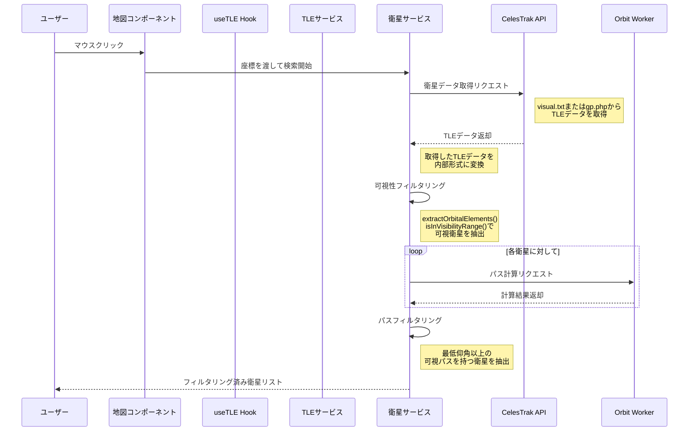

# 現状の処理フロー

## マウスクリックからTLEフィルタリングまでの流れ



## 現状の問題点と処理フロー解説

1. **APIからのデータ取得**
   - visual.txtまたはgp.phpエンドポイントからTLEデータを取得
   - 応答形式に応じてデータを解析（テキストまたはJSON）

2. **データ変換**
   - 取得したTLEデータを内部形式（`CelesTrakGPData`）に変換
   - この段階でデータは正常に取得できている

3. **可視性フィルタリング**
   ```typescript
   const filteredData = satelliteData.filter(data => {
     const orbitalElements = visibilityService.extractOrbitalElements(data.TLE_LINE2);
     const isVisible = visibilityService.isInVisibilityRange(observerLat, observerLng, orbitalElements);
     return isVisible;
   });
   ```
   - TLEのLine2から軌道要素を抽出
   - 観測地点からの可視性を判定
   - この段階で該当衛星が0になっている可能性がある

4. **パス計算とフィルタリング**
   ```typescript
   // Web Worker経由での処理
   const passes = await orbitService.calculatePasses(
     satellite.tle,
     loc,
     params
   );

   // Workerへの送信データ
   worker.postMessage({
     type: 'calculatePasses',
     tle,         // TLEデータ
     location,    // 観測地点の座標
     filters,     // 検索フィルター（最低仰角など）
   });
   ```

   - Worker内で軌道計算を実行（orbitWorker.ts）
   - 計算結果から最低仰角以上のパスを抽出
   - 結果をメインスレッドに返送

5. **Worker内での軌道計算処理**
   ```typescript
   // TLEデータの検証
   const satrec = satellite.twoline2satrec(tle.line1, tle.line2);
   if (!satrec) {
     throw new Error('Failed to parse TLE data');
   }

   // 時間ステップごとの計算（30秒間隔）
   while (currentTime <= endTime) {
     // 衛星の位置と速度を計算
     const positionAndVelocity = satellite.propagate(satrec, date);

     // 観測地点からの衛星の見かけの位置を計算
     const lookAngles = satellite.ecfToLookAngles(observerGd, positionEci);
     const elevation = satellite.degreesLat(lookAngles.elevation);

     // パスの判定（仰角が最小値以上の場合）
     if (elevation >= minElevation) {
       // パス開始または継続
     } else if (isVisible) {
       // パス終了
     }
   }
   ```

6. **最終フィルタリングと並び替え**
   ```typescript
   const filteredResults = results
     .filter(satellite => {
       const hasPasses = satellite.passes.length > 0;
       const hasVisiblePasses = satellite.passes.some(
         pass => pass.maxElevation >= params.minElevation
       );
       return hasPasses && hasVisiblePasses;
     })
     .sort((a, b) => {
       // 最大仰角で降順ソート
       const maxElevA = Math.max(...a.passes.map(p => p.maxElevation));
       const maxElevB = Math.max(...b.passes.map(p => p.maxElevation));
       return maxElevB - maxElevA;
     });
   ```

## デバッグのための重要な確認ポイント

1. TLEデータのバリデーション
   ```typescript
   // Worker内でのTLE検証
   function validateTLE(tle: TLEData): boolean {
     const satrec = satellite.twoline2satrec(tle.line1, tle.line2);
     if (!satrec) return false;

     // テスト計算で有効性確認
     const testDate = new Date();
     const positionAndVelocity = satellite.propagate(satrec, testDate);
     return !!(positionAndVelocity.position &&
       typeof positionAndVelocity.position !== 'boolean');
   }
   ```

2. 軌道計算のパラメータ
   - 計算期間: デフォルトで過去24時間から7日後まで
   - 時間ステップ: 30秒間隔（精度向上のため）
   - 最小仰角: フィルターで指定された値（デフォルト0度）

3. パス判定のログ出力
   ```typescript
   // 仰角が閾値付近の場合のデバッグ情報
   if (Math.abs(elevation - minElevation) < 1) {
     console.log('Visibility check near threshold:', {
       time: date.toISOString(),
       elevation,
       minElevation,
       isVisible,
       currentPassPoints: currentPass?.points.length || 0
     });
   }
   ```

## デバッグポイント

1. 可視性フィルタリングの結果を確認
   ```typescript
   console.log('Visibility filtering results:', {
     total: satelliteData.length,
     visible: filteredData.length,
     location: { lat: observerLat, lng: observerLng }
   });
   ```

2. 軌道要素抽出の処理
   ```typescript
   // TLE Line2からの抽出箇所
   const inclination = parseFloat(line2.substring(8, 16));     // 8-16文字目: 軌道傾斜角
   const meanMotion = parseFloat(line2.substring(52, 63));     // 52-63文字目: 平均運動
   const heightKm = Math.pow(331.25 / meanMotion, 2/3) * 42241 - 6371;  // 高度計算
   ```
   - TLE Line2のパース位置が正しいか確認
   - 高度計算の係数が適切か検証

3. 可視性判定の条件確認
   ```typescript
   // 判定条件
   if (absLat > maxVisibleLat) {
     // 条件1: 観測地点の緯度が最大可視緯度を超えている → 不可視
     return false;
   }
   if (orbitalElements.inclination > 80) {
     // 条件2: 極軌道に近い衛星は全経度で可視
     return true;
   }
   // 条件3: その他の場合は可視と判定（詳細は軌道計算時）
   return true;
   ```
   - 最大可視緯度の計算が正しいか確認
   - 極軌道判定の閾値（80度）が適切か検証
   - 各条件でのログ出力を確認

4. デバッグログの確認ポイント
   - Satellite not visible: 最大可視緯度超過のログ
   - Satellite is in near-polar orbit: 極軌道判定のログ
   - Satellite potentially visible: その他の場合のログ

## 問題の可能性がある箇所

1. **可視性フィルタリング時の問題**
   - 現状: `visibilityService.isInVisibilityRange()`で多くの衛星が除外されている
   - 考えられる原因:
     * 軌道傾斜角の解析が厳格すぎる
     * 可視範囲の計算が保守的すぎる
     * 極軌道の判定閾値（80度）が高すぎる

2. **TLEデータ処理の問題**
   - TLE Line2のパース位置が仕様と異なっている可能性
   - 高度計算の係数（331.25, 42241）の妥当性確認が必要
   - 平均運動からの高度計算方法の見直し

3. **改善案**
   - 可視性判定の緩和（初期フィルタリングを緩めに設定）
   - TLEパース処理の見直しと検証
   - デバッグログの強化（中間値の出力追加）
